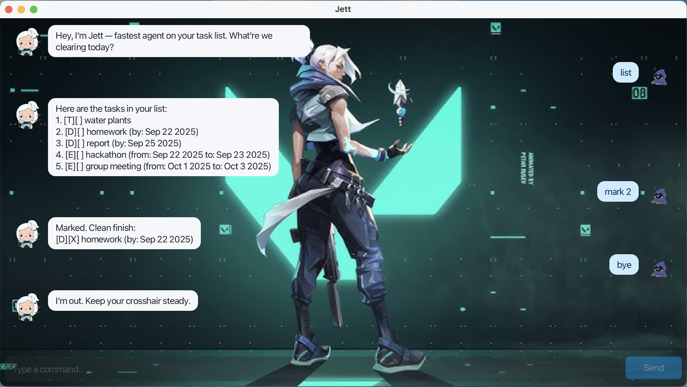

# Jett User Guide

**Jett** is a desktop chatbot app that helps you manage your tasks. It is optimised for fast typing with a Command Line Interface (CLI), while still giving you the convenience of a Graphical User Interface (GUI). If you prefer keyboard commands but still want a clean interface, Jett is built for you.



---
## Quick start

1. Ensure you have **Java 17** or above installed on your computer.
    - Mac users: ensure you have the precise JDK version prescribed [here](https://www.jetbrains.com/help/idea/sdk.html#set-up-jdk).
2. Download the latest **`.jar` file** of Jett from [here](https://github.com).
3. Place the file in a folder you want to use as the home folder for Jett.
4. Open a command terminal, `cd` into the folder, and run:

   ```
   java -jar jett.jar
   ```  

5. A GUI window will appear with Jett's greeting.
6. Type a command in the text box and press **Enter** (or click **Send**) to start interacting.

Some example commands you can try:
- `list` : Lists all tasks.
- `todo read book` : Adds a todo task.
- `deadline return book /by Sep 21 2025` : Adds a deadline task.
- `event camp /from Sep 20 2025 /to Sep 22 2025` : Adds an event task.
- `delete 2` : Deletes the 2nd task in the list.
- `bye` : Exits the app.

Refer to [Features](#features) below for details of each command.

---

## Features

:information_source: **Notes about the command format:**
- Words in **UPPER_CASE** are parameters to be supplied by you.  
  Example: in `todo DESCRIPTION`, `DESCRIPTION` is a parameter which can be used as `todo read book`.
- Items in **square brackets** are optional.  
  Example: `list [/alphabetical]` can be just `list` or `list /alphabetical`.
- Parameters must be entered in the specified order.
- Task indexes refer to the number shown in the task list.

---

### Adding a todo : `todo`
Adds a simple to-do task with just a description.

**Format:**
```
todo DESCRIPTION
```  

**Examples:**
- `todo buy groceries`
- `todo read book`

---

### Adding a deadline : `deadline`
Adds a task that must be completed by a specific date.  
Dates can be in `yyyy-MM-dd`, `d/M/yyyy`, or `MMM d yyyy` formats.

**Format:**
```
deadline DESCRIPTION /by DATE
```  

**Examples:**
- `deadline submit assignment /by 2025-09-30`
- `deadline return book /by 30/9/2025`
- `deadline finish report /by Sep 30 2025`

---

### Adding an event : `event`
Adds a task that spans from a start date to an end date.

**Format:**
```
event DESCRIPTION /from START_DATE /to END_DATE
```  

**Examples:**
- `event camp /from Sep 20 2025 /to Sep 22 2025`
- `event conference /from 2025-09-21 /to 2025-09-23`

---

### Listing tasks : `list`
Displays your current tasks.
You can sort them in different ways (alphabetical order, date order or type order).

**Format:**
```
list [/alphabetical | /date | /type] 
```

**Examples:**
- `list` — shows tasks in the order added.
- `list /alphabetical` — sorts by description.
- `list /date` — sorts by date.
- `list /type` — groups todos, deadlines, and events.

---

### Marking a task as done : `mark`
Marks the specified task as done.

**Format:**
```
mark INDEX
```  

**Example:**
- `mark 2` — marks the 2nd task in the list as done.

---

### Unmarking a task : `unmark`
Marks the specified task as not done yet.

**Format:**
```
unmark INDEX
```  

**Example:**
- `unmark 2` — marks the 2nd task as not done.

---

### Deleting a task : `delete`
Deletes the specified task from the list.

**Format:**
```
delete INDEX
```  

**Example:**
- `delete 3` — deletes the 3rd task in the list.

---

### Finding tasks : `find`
Searches for tasks containing a keyword in their description.  
Search is case-insensitive.

**Format:**
```
find KEYWORD
```  

**Examples:**
- `find book` — finds all tasks with “book” in the description.
- `find report` — finds all tasks mentioning “report”.

---

### Exiting the program : `bye`
Closes the application.

**Format:**
```
bye
```  

---

## Saving the data
- Jett automatically saves your tasks after every command that modifies data.
- Your data is stored in the hard disk at:
  ```
  [JAR file location]/data/Jett.txt
  ```  
- There is no need to save manually.

---

## Editing the data file
Advanced users may edit `Jett.txt` directly to change saved tasks.

:exclamation: **Caution:** If you make formatting errors, Jett may fail to load the file and will start with an empty task list. Always back up before editing manually.

---

## FAQ

**Q:** How do I transfer my data to another computer?  
**A:** Install Jett on the other computer, then overwrite its empty `data/Jett.txt` file with your existing file.

---

## Command summary

| Action    | Format & Example |
|-----------|------------------|
| **Todo** | `todo DESCRIPTION`<br>e.g. `todo read book` |
| **Deadline** | `deadline DESCRIPTION /by DATE`<br>e.g. `deadline finish report /by Sep 30 2025` |
| **Event** | `event DESCRIPTION /from DATE /to DATE`<br>e.g. `event camp /from Sep 6 2025 /to Sep 7 2025` |
| **List** | `list [/alphabetical or /date or /type]`<br>e.g. `list /type` |
| **Mark** | `mark INDEX`<br>e.g. `mark 2` |
| **Unmark** | `unmark INDEX`<br>e.g. `unmark 2` |
| **Delete** | `delete INDEX`<br>e.g. `delete 3` |
| **Find** | `find KEYWORD`<br>e.g. `find book` |
| **Exit** | `bye` |

---

Jett is simple, fast, and designed to keep your tasks organised while you focus on getting things done.
